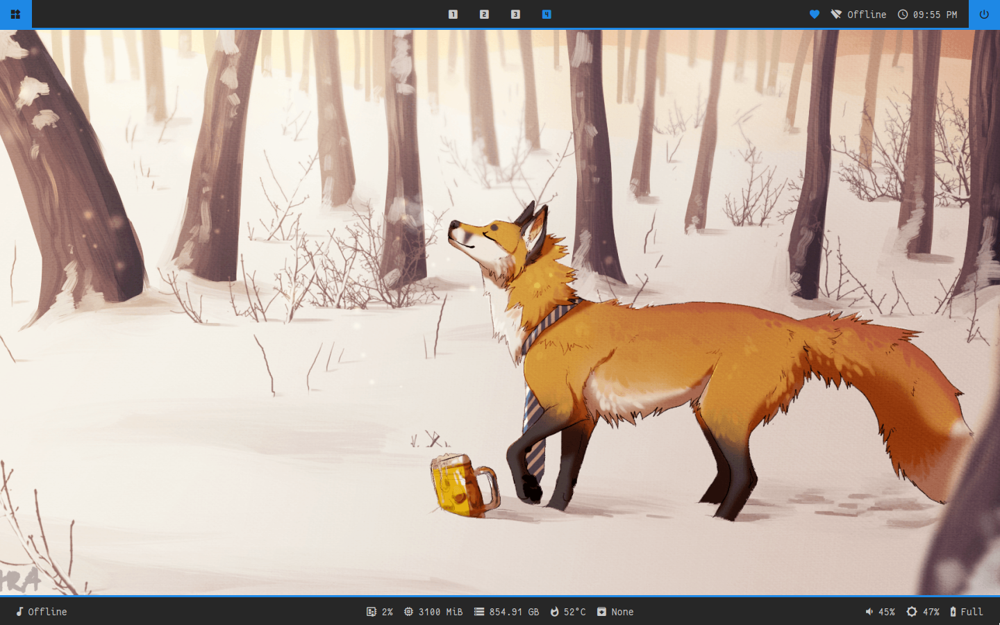

# I3wm Config

Just a backup of my I3wm configuration. Feel free to use it if you'd like <3

## Preview

## To Use

Simply copy and paste the `i3` directory into `~/.config`  
then copy the `fonts` directory into `~/.local/share/fonts`  
and enjoy :3  

Please note: Some packages used in this config may not be installed on your system. Nothing should fully break, but please just keep that in mind. Just in case, I'll list some of the packages used below.  

-   calc
-   dmenu
-   dunst
-   feh
-   firefox
-   i3blocks
-   i3lock
-   i3status
-   i3-wm
-   imagemagick
-   mpd
-   mpv
-   picom
-   polybar
-   python-pywal
-   rofi
-   scrot
-   thunar
-   xfce4-terminal
-   xclip
-   xdotool

(these are in the AUR)
-   autotiling
-   networkmanager-dmenu-git
-   xwinwrap-0.9-bin 
